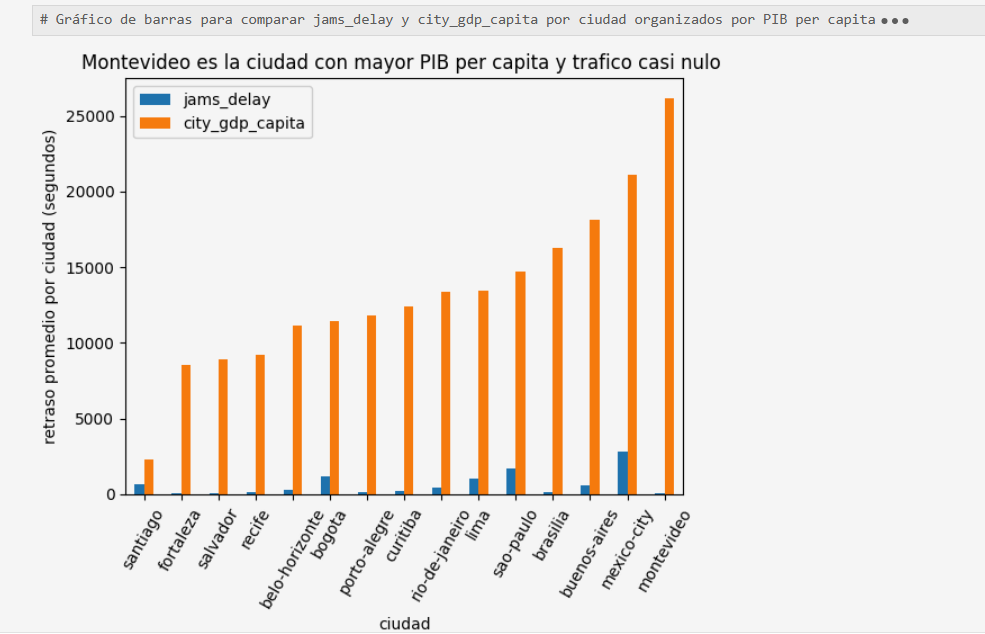
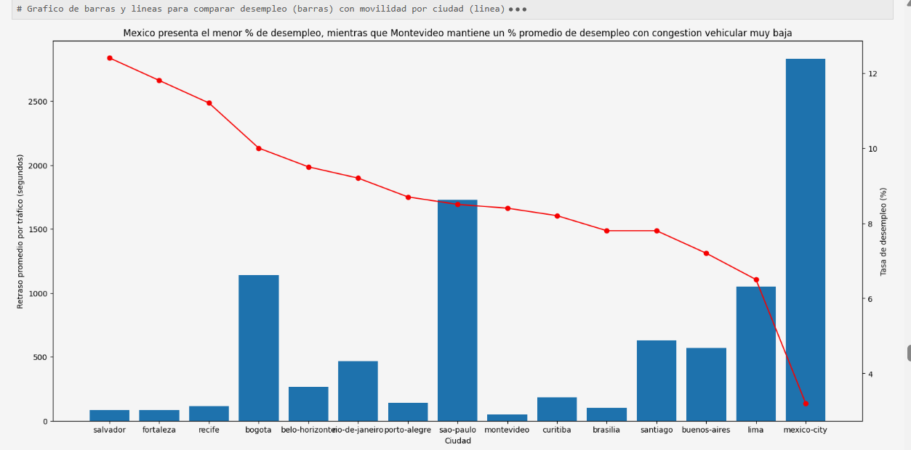
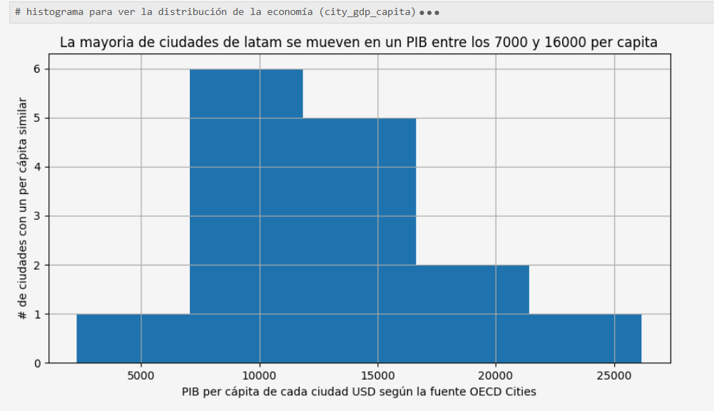
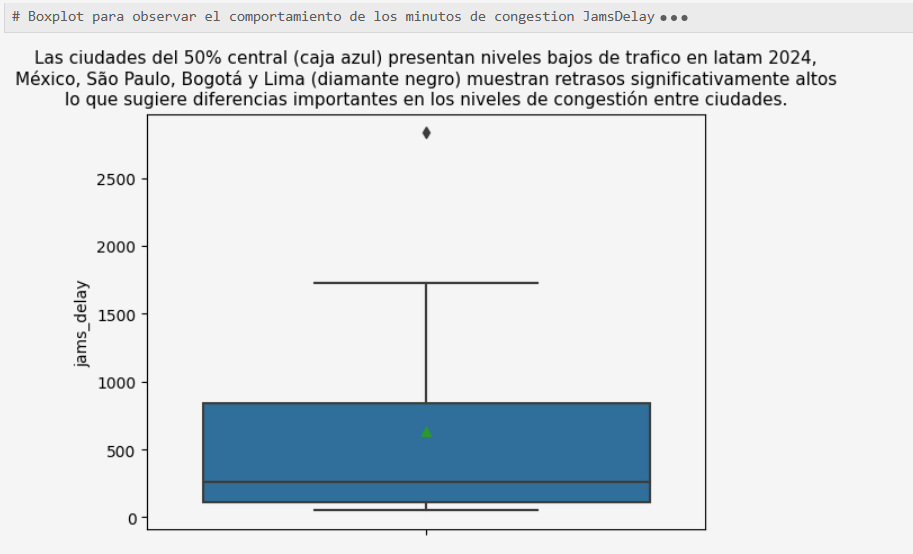

# Adventureworks-financial-ROI-analysis
# 🌎 Urban Mobility & Economic Productivity Analysis (IDB)

## 📌 Project Overview

This project analyzes the relationship between urban mobility and economic productivity across major Latin American cities using datasets from the Inter-American Development Bank (IDB).

The objective was to identify traffic congestion patterns and explore how mobility indicators may impact economic performance to support data-driven decision-making.

---

## 🎯 Business Problem

Traffic congestion is a major challenge across Latin America, affecting productivity, economic development, and quality of life.

The goal of this analysis was to integrate mobility and economic datasets to identify trends, compare cities, and generate actionable insights for urban planning and investment prioritization.

---

## 📂 Dataset

Two external datasets were used:

- Urban mobility dataset
- Economic indicators dataset

Variables analyzed:

- Average traffic delay
- GDP per capita
- Unemployment rate
- Population
- City-level information

---

## 🛠️ Project Workflow

1. Data collection
2. Data cleaning and validation
3. Data transformation
4. Data integration
5. Exploratory Data Analysis (EDA)
6. Data visualization
7. Insight generation
8. Business recommendations

---

## 📊 Key Findings

- São Paulo, Bogotá, and Lima presented some of the highest congestion levels.
- Montevideo showed strong economic performance with relatively low traffic congestion.
- No direct relationship was found between GDP per capita and traffic congestion.
- Several cities with high congestion may benefit from mobility improvement initiatives.

---

## 💡 Business Recommendations

- Prioritize investment in cities with high congestion and lower economic efficiency.
- Implement urban mobility initiatives to improve productivity.
- Use integrated mobility and economic data to support strategic planning.
- Continuously monitor traffic indicators to identify future opportunities.

---

## 🧰 Technologies Used

- Python
- Pandas
- NumPy
- Matplotlib
- Jupyter Notebook

### Analytical Skills

- Data Cleaning
- Data Transformation
- Exploratory Data Analysis (EDA)
- Correlation Analysis
- Data Visualization
- Business Intelligence
- Data Storytelling

---

## 📁 Repository Structure

```

├── data/
├── notebooks/
│ └── mobility_economy_analysis.ipynb
├── images/
└── README.md

```
## 📊 Visualizations

### Traffic Congestion vs GDP per Capita



### Unemployment and Urban Mobility



### Economic Distribution



### Outliers Analysis



```

## 👨‍💻 Author

Danilo Elías Gallego López

Junior Data Analyst | Reporting | Business Intelligence | Customer Insights

📧 danyd686@gmail.com

🔗 LinkedIn: (Add your LinkedIn URL here)
```
