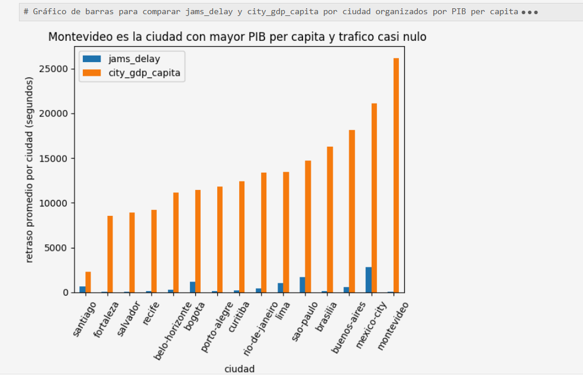
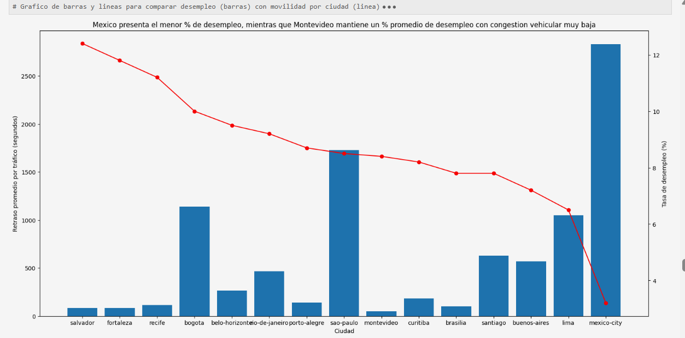
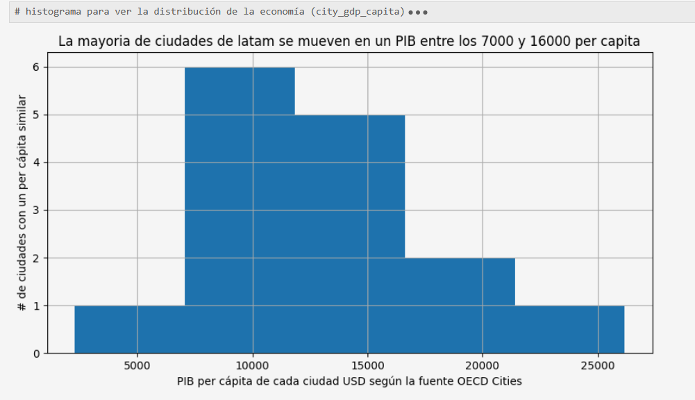
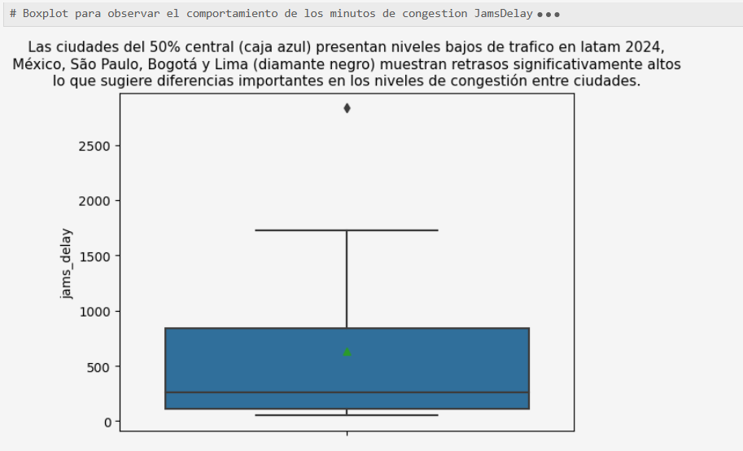

# 🌎 Urban Mobility & Economic Productivity Analysis (IDB)

## 📌 Project Overview

This project analyzes the relationship between urban mobility and economic productivity across major Latin American cities using datasets from the Inter-American Development Bank (IDB).

The objective was to identify traffic congestion patterns and explore how mobility indicators may impact economic performance to support data-driven decision-making.

---

## 🎯 Business Problem

Traffic congestion negatively impacts economic productivity and quality of life in large urban markets.

The objective was to identify cities with the highest congestion levels and prioritize investment opportunities.

---

## 🚀 My contribution to the project

- Analyzed 15 LATAM cities  
- Integrated 2 external datasets  
- Identified 3 priority cities for infrastructure investment  
- Detected traffic delays exceeding 1700 seconds in high-congestion markets  

---
## 📂 Dataset

Two external datasets were used:

- Urban mobility dataset
- Economic indicators dataset

Variables analyzed:

- Average traffic delay
- GDP per capita
- Unemployment rate
- Population
- City-level information

---

## 🛠️ Project Workflow

1. Data collection
2. Data cleaning and validation
3. Data transformation
4. Data integration
5. Exploratory Data Analysis (EDA)
6. Data visualization
7. Insight generation
8. Business recommendations

---

## 📊 Key Findings & Learning

- São Paulo, Bogotá, and Lima presented some of the highest congestion levels.
- Montevideo showed strong economic performance with relatively low traffic congestion.
- No direct relationship was found between GDP per capita and traffic congestion.
- Several cities with high congestion may benefit from mobility improvement initiatives.
- Strengthened skills in Python, EDA, data visualization, and analytical storytelling.
  
---
## 🔎 Approach & Key Decisions

- Combined mobility and economic indicators to analyze congestion from multiple perspectives.
- Reviewed data distributions and potential outliers before comparing cities.
- Used correlation analysis to test the relationship between GDP per capita and congestion.
- Avoided assuming that stronger economic performance automatically meant lower congestion.

---
## 💡 Business Recommendations

- Prioritize investment in cities with high congestion and lower economic efficiency.
- Implement urban mobility initiatives to improve productivity.
- Use integrated mobility and economic data to support strategic planning.
- Continuously monitor traffic indicators to identify future opportunities.

---
---
## 📊 Visualizations

### Traffic Congestion vs GDP per Capita



### Unemployment and Urban Mobility



### Economic Distribution



### Outliers Analysis



---
## 🧰 Technologies Used

## 🛠️ Tools & Analytical Decisions

* **Python & Pandas:** Used to clean, transform, integrate, and analyze mobility and economic datasets.
* **Exploratory Data Analysis:** Reviewed distributions, outliers, and differences between cities before performing comparisons.
* **Data Visualization:** Created visualizations to make differences in congestion and economic indicators easier to identify and interpret.
* **Correlation Analysis:** Tested the relationship between GDP per capita and congestion instead of assuming that economic performance directly explained mobility conditions.
* **Comparative Analysis:** Combined mobility and economic indicators to evaluate cities from multiple perspectives.
* **Data Interpretation:** Focused on identifying meaningful patterns and differences rather than simply reporting descriptive statistics.
* **Business Communication:** Translated analytical findings into clear conclusions and recommendations that could support urban planning and investment decisions.
---

## 📁 Repository Structure

```


├── data/
├── notebooks/
│ └── mobility_economy_analysis.ipynb
├── images/
└── README.md

```
---

## 👨‍💻 Author

**Danilo Elías Gallego López**

Junior Data Analyst | Reporting | Business Intelligence | Sales Analytics

📧 danyd686@gmail.com

🔗 LinkedIn: www.linkedin.com/in/danilogallego
---

